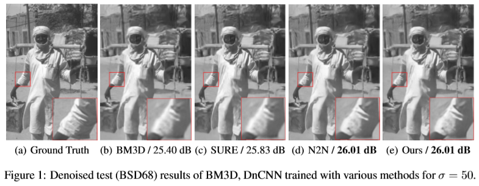
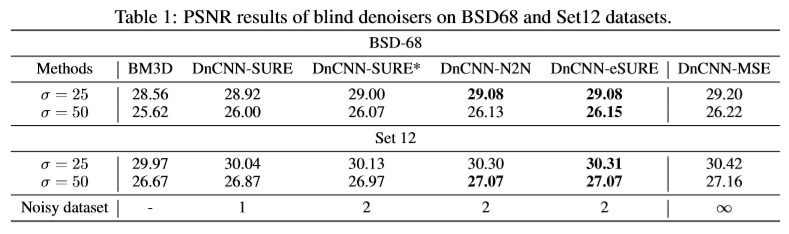
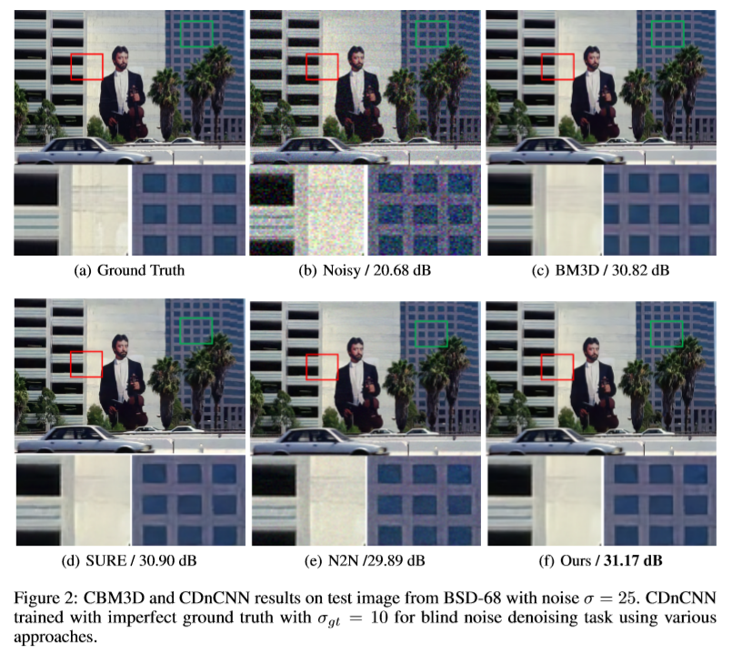
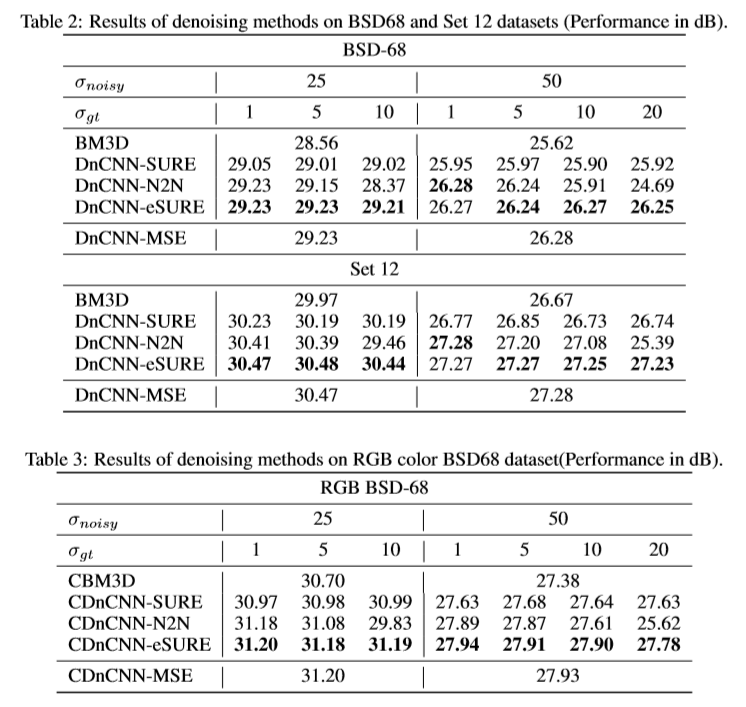
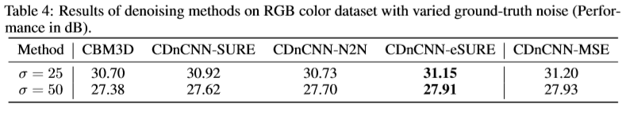

# NeurIPS 2019 paper official TF implementation - Extending Stein's Unbiased Risk Estimator to Train Deep Denoisers with Correlated Pairs of Noisy Images

**[Magauiya Zhussip](https://scholar.google.com/citations?user=BPFAXOsAAAAJ&hl=en), [Shakarim Soltanayev](https://scholar.google.com/citations?user=gXCU5RcAAAAJ&hl=en), [Se Young Chun](https://seyoungchun.wordpress.com/profile/)**

**Abstract:**

*Recently, Stein's unbiased risk estimator (SURE) has been applied to unsupervised training of deep neural network Gaussian denoisers that outperformed classical non-deep learning based denoisers and yielded comparable performance to those trained with ground truth. While SURE requires only one noise realization per image for training, it does not take advantage of having multiple noise realizations per image when they are available (e.g., two uncorrelated noise realizations per image for Noise2Noise). Here, we propose an extended SURE (eSURE) to train deep denoisers with correlated pairs of noise realizations per image and applied it to the case with two uncorrelated realizations per image to achieve better performance than SURE based method and comparable results to Noise2Noise. Then, we further investigated the case with imperfect ground truth (i.e., mild noise in ground truth) that may be obtained considering painstaking, time-consuming, and even expensive processes of collecting ground truth images with multiple noisy images. For the case of generating noisy training data by adding synthetic noise to imperfect ground truth to yield correlated pairs of images, our proposed eSURE based training method outperformed
conventional SURE based method as well as Noise2Noise.*

#### Full Paper and Supplements can be found [here](https://nips.cc/Conferences/2019/AcceptedPapersInitial)

## How to run
This code was tested using Python 2.7.
### Dependencies:
- numpy==1.14.5
- scipy==1.1.0
- tensorflow==1.10.0

### Patch generation for training 
To reproduce experimental results, firstly generate ground-truth patches: 
```
python2 generate_patches_rgb_gt.py 
```
Then, generate imperfect ground-truth image patches with mild noise and noisy image patches: 
```
python2 generate_patches_rgb_noisy.py --std_imp_min=5. --std_imp_max=10. --std_noisy_max=55.
```

### Training the network
To train the network with proposed Extended SURE:
```
python2 main_blind_rgb.py --phase=train --sigma=50. --cost e-SURE --gt_type=10 --type blind_50_gt10 --test_set='CBSD68'
```
You can change hyperparameters (e.g. epochs, batch, learning rate, etc.) and try different cost functions by changing cost from e-SURE to N2N or MSE or SURE.  

### Testing using the trained network
To test the network that was trained with Extended SURE (ours):
```
python2 main_blind_rgb.py --phase=test --sigma=50. --cost e-SURE --gt_type=10 --type='blind_50_gt10' --test_set='CBSD68'
```

### Additional comments
1. It is highly recommended to use GPU for training/testing phase. 
2. Network architecture can be easily changed from DnCNN to any preferred one. Please, check model_blind_rgb.py for that. 
3. Checkpoint weights are saved in ./checkpoint folder, sample noisy/denoised images for validation are in ./sample folder, while denoised test images can be found ./test folder. 


## Paper Results
### Part 1 - Two uncorrelated Gaussian noise realizations per image



### Part 2 - Imperfect ground-truth: Correlated Gaussian noise





## Reference
* Code structure follows the repository [DnCNN-Tensorflow](https://github.com/crisb-DUT/DnCNN-tensorflow) of @crisb-DUT (dataset import and feeding, loading checkpoints etc.).
